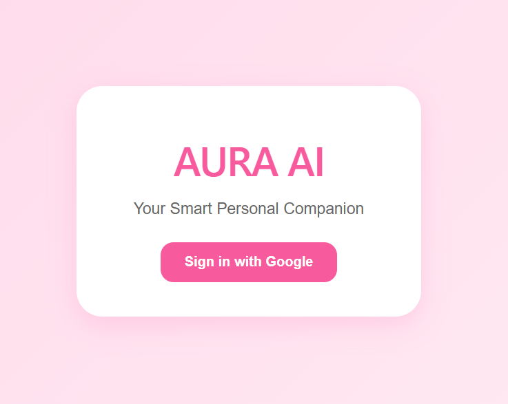
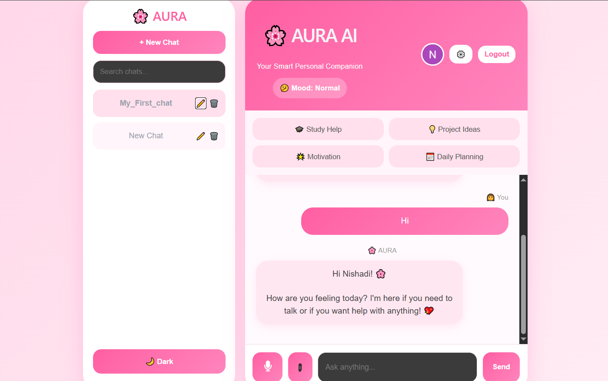
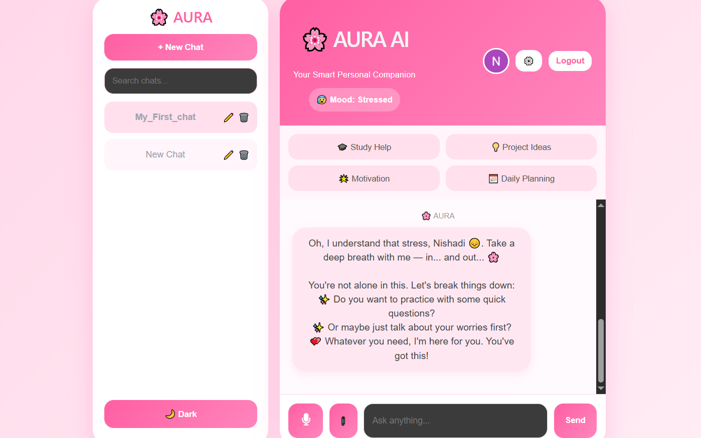
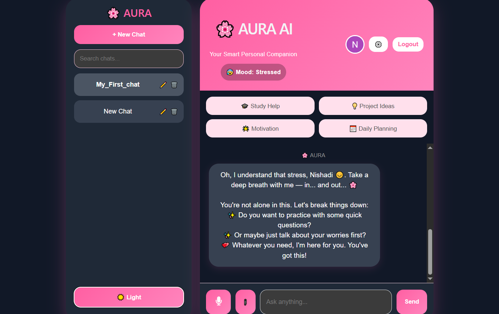

# 🌸 AURA AI

> **Emotion-Aware Personal AI Companion built with React, Firebase, Firestore and OpenRouter AI.**

AURA AI is an intelligent AI companion that provides personalized conversations by understanding user emotions. The application combines AI chat, image analysis, emotion detection, Google Authentication, and cloud storage to create a modern personal assistant.

---

## 🌐 Live Demo

🔗 https://emotion-aware-aura-ai-nishadi.netlify.app

---

## ✨ Features

- 🤖 AI Chat Assistant
- 😊 Emotion-Aware Responses
- 🧠 Mood Detection from Images
- 🖼 AI Image Analysis
- 🔐 Google Authentication
- 💾 Firebase Firestore Database
- 💬 Multiple Chat Conversations
- ➕ Create New Chats
- 🔍 Search Conversations
- ✏ Rename Chats
- 🗑 Delete Chats
- 🎤 Voice Input
- 🌙 Dark / Light Theme
- 📄 Export Chat as PDF
- 📝 Export Chat as Word Document
- ⚙ Settings Panel
- 📱 Responsive User Interface

---

## 🛠 Tech Stack

| Technology | Purpose |
|------------|---------|
| React | Frontend |
| Vite | Build Tool |
| Firebase Authentication | Google Login |
| Cloud Firestore | Database |
| OpenRouter API | AI Models |
| DeepSeek Chat V3.1 | AI Chat |
| Qwen 2.5 Vision | Image Analysis |
| JavaScript | Programming Language |
| CSS3 | Styling |
| Netlify | Deployment |
| GitHub | Version Control |

---

## 📸 Screenshots

### 🔐 Login



---

### 💬 Home



---

### 😊 Emotion Detection



---

### 🌙 Dark Mode



## 🚀 Live Features

- Google Sign In
- AI Chat
- Image Upload & Analysis
- Emotion Detection
- Voice Input
- Chat History
- Firestore Cloud Storage

---

## 🚀 Installation

Clone the repository

```bash
git clone https://github.com/Navodya52/Emotion-Aware-AURA_AI.git
```

Go to the project

```bash
cd Emotion-Aware-AURA_AI
```

Install dependencies

```bash
npm install
```

Create a `.env` file

```env
VITE_OPENROUTER_API_KEY=your_openrouter_api_key
VITE_VISION_MODEL=qwen/qwen2.5-vl-72b-instruct:free
```

Run the application

```bash
npm run dev
```

---

## 📁 Folder Structure

```
src/
│
├── hooks/
├── pages/
├── services/
├── utils/
├── App.jsx
└── main.jsx
```

---

## 🔐 Environment Variables

Create a `.env` file in the project root.

```env
VITE_OPENROUTER_API_KEY=your_openrouter_api_key
VITE_VISION_MODEL=qwen/qwen2.5-vl-72b-instruct:free
```

A sample configuration is provided in:

```
.env.example
```

---

## 📦 Deployment

This project is deployed using **Netlify**.

Every push to the **main** branch automatically triggers a new deployment.

---

## 👩‍💻 Developer

**Nishadi Wickramaarachchi**

🎓 Faculty of Computing  
University of Sri Jayewardenepura  
Sri Lanka

GitHub: https://github.com/Navodya52

---

## ⭐ Support

If you found this project useful, please consider giving it a ⭐ on GitHub.

---

## 📄 License

This project is licensed under the MIT License.
